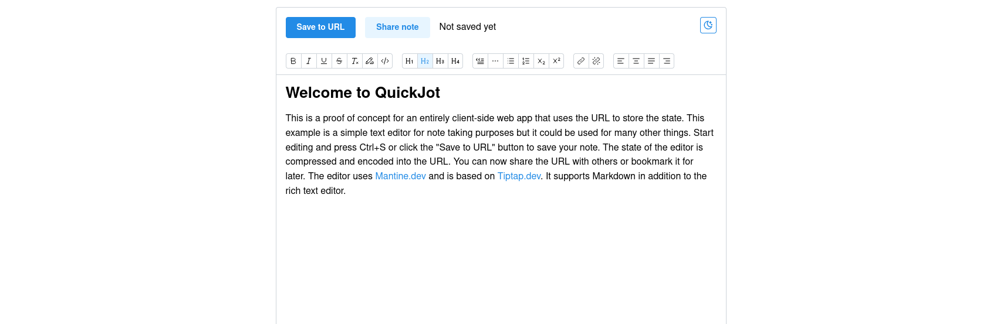

## QuickJot

Proof of concept for an entirely client-side web app that uses the URL to store the state.
This example is a simple text editor for note taking but the concept could be used for many other things.
Start editing and press Ctrl+S or click the "Save to URL" button to save your note.
The state of the editor is compressed and encoded into the URL.
You can now share the URL with others or bookmark it for later.
The editor uses Mantine.dev and is based on Tiptap.dev.
It supports Markdown in addition to the rich text editor.

